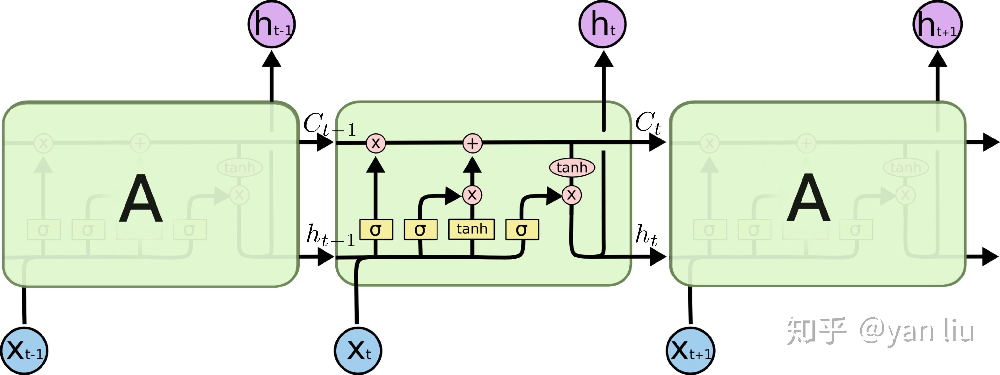
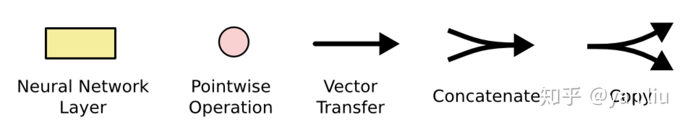
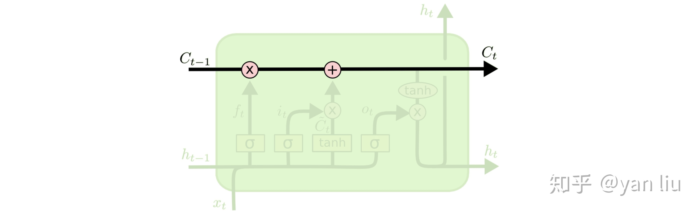
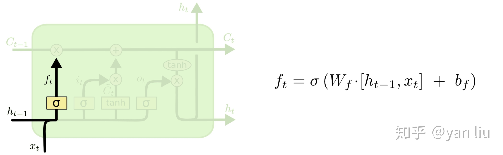
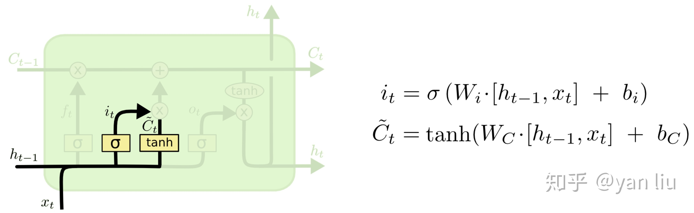
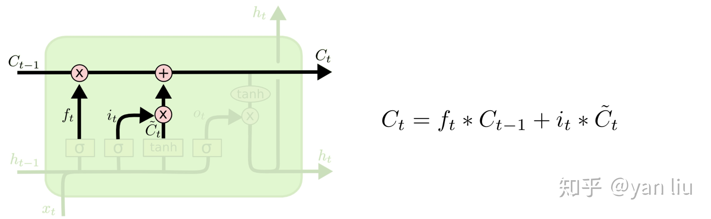
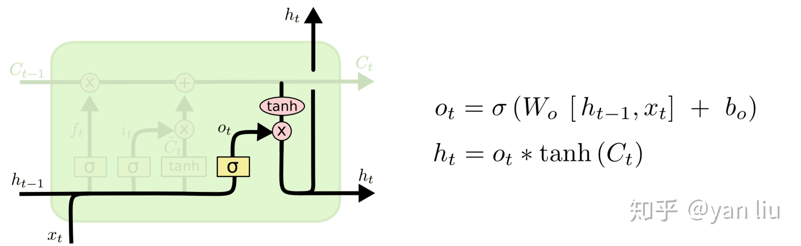
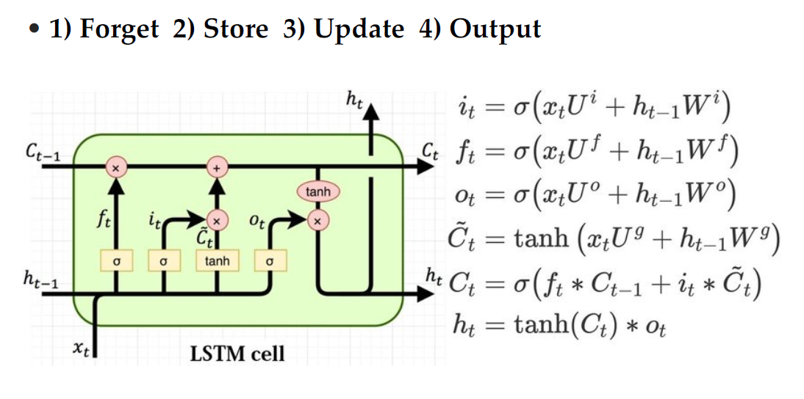
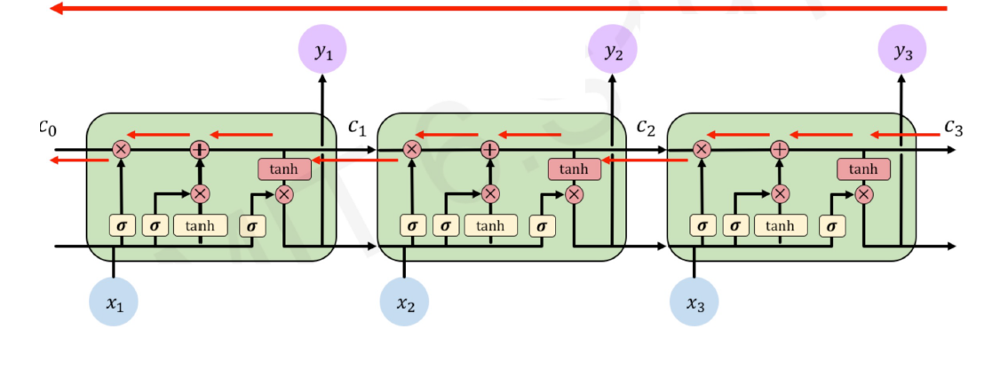

## LSTM的原理

### 概述

LSTM的全称是Long Short Term Memory，它具有记忆长短期信息的能力的神经网络。LSTM提出的动机是为了解决传统的RNN的长期依赖问题。

而LSTM之所以能够解决RNN的长期依赖问题，是因为LSTM引入了门（gate）机制用于控制特征的流通和损失。LSTM是由一系列LSTM单元（LSTM Unit）组成，其链式结构如图x-1。

    

<small>图x-1</small>

### 定义
先定义LSTM单元中每个符号的含义。每个黄色方框表示一个神经网络层，由权值，偏置以及激活函数组成；每个粉色圆圈表示元素级别操作；箭头表示向量流向；相交的箭头表示向量的拼接；分叉的箭头表示向量的复制。总结如图x-2.

    

<small>图x-2</small>

LSTM的核心部分是在图x-3中最上边类似于传送带的部分，这一部分一般叫做单元状态（cell state）它自始至终存在于LSTM的整个链式系统中。

其更新方法为：

$$C_{t}=f_{t} \times C_{t-1}+i_{t} \times \tilde{C}_{t}$$

    

<small>图x-3</small>

### 具体步骤
LSTM的工作原理分为四个主要步骤：
1. 遗忘
2. 存储
3. 更新
4. 输出

#### 1. 遗忘
如图x-4所示，$f_t$叫做遗忘门，表示 $C_{t-1}$的哪些特征被用于计算 $C_t$。 $f_t$是一个向量，向量的每个元素均位于 $[0,1]$ 范围内。通常我们使用 $sigmoid$ 作为激活函数， $sigmoid$的输出是一个介于 $[0,1]$区间内的值，但是在一个训练好的LSTM中，门的值绝大多数都非常接近0或者1，其余的值少之又少。其中 $\otimes$ 是LSTM最重要的门机制，表示 $f_t$ 和 $C_{t-1}$之间的单位乘的关系。

    

<small>图x-4</small>

#### 2. 存储
如图x-5所示， $\tilde{C}_{t}$ 表示单元状态更新值，由输入数据 $x_t$ 和隐节点 $h_{t-1}$ 经由一个神经网络层得到，单元状态更新值的激活函数通常使用 $tanh$ 。 $i_t$ 叫做输入门，同 $f_t$ 一样也是一个元素介于 $[0,1]$ 区间内的向量，同样由 $x_t$ 和 $h_{t-1}$ 经由 $sigmoid$ 激活函数计算而成。

    

<small>图x-5</small>

#### 3. 更新
$i_t$ 用于控制  $\tilde{C}_{t}$ 的哪些特征用于更新 $C_t$ ，使用方式和 $f_t$ 相同（图x-6）。

    

<small>图x-6</small>

#### 4. 输出

最后，为了计算预测值 $\hat{y}_{t}$ 和生成下个时间片完整的输入，我们需要计算隐节点的输出 $h_t$ （图x-7）。

    

<small>图x-7</small>

$h_t$ 由输出门 $o_t$ 和单元状态 $C_t$ 得到，其中 $o_t$ 的计算方式和 $f_t$ 以及 $i_t$ 相同。

总览如图x-8

    

<small>图x-8</small>

### 前向传播算法

LSTM模型有两个隐藏状态$h^{(t)},C^{(t)}$ ，模型参数几乎是RNN的4倍，因为现在多了$W_f,U_f,b_f,W_a,U_a,b_a,W_i,U_i,b_i,W_o,U_o,b_o$这些参数。梯度流如图x-9所示。

<small>图x-9</small>

前向传播过程在每个序列索引位置的过程为：

1. 更新遗忘门输出：
$$f^{(t)}=\sigma\left(W_{f} h^{(t-1)}+U_{f} x^{(t)}+b_{f}\right)$$
2. 更新输入门两部分输出：
$$\begin{array}{c}
i^{(t)}=\sigma\left(W_{i} h^{(t-1)}+U_{i} x^{(t)}+b_{i}\right) \\
a^{(t)}=\tanh \left(W_{a} h^{(t-1)}+U_{a} x^{(t)}+b_{a}\right)
\end{array}$$

3. 更新细胞状态：

$$C^{(t)}=C^{(t-1)} \odot f^{(t)}+i^{(t)} \odot a^{(t)}$$

4. 更新输出门输出：

$$\begin{array}{c}
o^{(t)}=\sigma\left(W_{o} h^{(t-1)}+U_{o} x^{(t)}+b_{o}\right) \\
h^{(t)}=o^{(t)} \odot \tanh \left(C^{(t)}\right)
\end{array}$$

5. 更新当前序列索引预测输出：

$$\hat{y}^{(t)}=\sigma\left(V h^{(t)}+c\right)$$

### 反向传播算法

有了LSTM反向传播算法思路和RNN的反向传播算法思路一致，也是通过梯度下降法迭代更新所有的参数，关键点在于计算所有参数基于损失函数的偏导数。

在RNN中，为了反向传播误差，我们通过隐藏状态  $h^{(t)}$  的梯度  $\delta^{(t)}$  一步步向前传播。在LSTM这里也类似。只不过我们这里有两个隐藏状态 $h^{(t)}$  和 $ C^{(t)}$。  这里我们定义两个  $\delta$  ，即:
$$
\begin{aligned}
\delta_{h}^{(t)} &=\frac{\partial L}{\partial h^{(t)}} \\
\delta_{C}^{(t)} &=\frac{\partial L}{\partial C^{(t)}}
\end{aligned}
$$

为了便于推导，我们将损失函数  $L(t)$  分成两块，一块是时刻  $t$  位置的损失  $l(t)$  ，另一块是时刻  $t$  之后损失  $L(t+1)$  ，即:
$$
L(t)=\left\{\begin{array}{ll}
l(t)+L(t+1) & \text { if } t<\tau \\
l(t) & \text { if } t=\tau
\end{array}\right.
$$
而在最后的序列索引位置  $\tau$  的  $\delta_{h}^{(\tau)}$  和  $\delta_{C}^{(\tau)} $ 为:
$$
\begin{array}{c}
\delta_{h}^{(\tau)}=\left(\frac{\partial o^{(\tau)}}{\partial h^{(\tau)}}\right)^{T} \frac{\partial L^{(\tau)}}{\partial o^{(\tau)}}=V^{T}\left(\hat{y}^{(\tau)}-y^{(\tau)}\right) \\
\delta_{C}^{(\tau)}=\left(\frac{\partial h^{(\tau)}}{\partial C^{(\tau)}}\right)^{T} \frac{\partial L^{(\tau)}}{\partial h^{(\tau)}}=\delta_{h}^{(\tau)} \odot o^{(\tau)} \odot\left(1-\tanh ^{2}\left(C^{(\tau)}\right)\right)
\end{array}
$$
接着我们由  $\delta_{C}^{(t+1)}$, $\delta_{h}^{(t+1)}$  反向推导  $\delta_{h}^{(t)}, \delta_{C}^{(t)}$  。

$\delta_{h}^{(t)}$  的梯度由本层时刻的输出梯度误差和大于妒刻的误差两部分决定，即:
$$
\delta_{h}^{(t)}=\frac{\partial L}{\partial h^{(t)}}=\frac{\partial l(t)}{\partial h^{(t)}}+\left(\frac{\partial h^{(t+1)}}{\partial h^{(t)}}\right)^{T} \frac{\partial L(t+1)}{\partial h^{(t+1)}}=V^{T}\left(\hat{y}^{(t)}-y^{(t)}\right)+\left(\frac{\partial h^{(t+1)}}{\partial h^{(t)}}\right)^{T} \delta_{h}^{(t+1)}
$$
整个LSTM反向传播的难点就在于  $\frac{\partial h^{(t+1)}}{\partial h^{(t)}} $  这部分的计算。仔细观察，由于  $h^{(t)}=o^{(t)} \odot \tanh \left(C^{(t)}\right)$在第一项 $ o^{(t)}$ 中，包含一个  $h$  的递推关系，第二项  $\tanh \left(C^{(t)}\right)$  就复杂了，  $\tanh$  函数里面又可以表示成:

$$C^{(t)}=C^{(t-1)} \odot f^{(t)}+i^{(t)} \odot a^{(t)}$$

$\tanh$  函数的第一项中，  $f^{(t)}$  包含一个  $h$  的递推关系，在  $\tanh$  函数的第二项中，  $i^{(t)}$  和  $a^{(t)}$  都包含  $h$  的递推关系，因此，最终  $\frac{\partial h^{(t+1)}}{\partial h(t)}$  这部分的计算结果由 四部分组成。即:

$$\begin{array}{c}
\Delta C=o^{(t+1)} \odot\left[1-\tanh ^{2}\left(C^{(t+1}\right)\right] \\
\frac{\partial h^{(t+1)}}{\partial h^{(t)}}=\operatorname{diag}\left[o^{(t+1)} \odot\left(1-o^{(t+1)}\right) \odot \tanh \left(C^{(t+1)}\right)\right] W_{o}+\operatorname{diag}\left[\Delta C \odot f^{(t+1)} \odot\left(1-f^{(t+1)}\right) \odot C^{(t)}\right] W_{f} \\
+\operatorname{diag}\left\{\Delta C \odot i^{(t+1)} \odot\left[1-\left(a^{(t+1)}\right)^{2}\right]\right\} W_{a}+\operatorname{diag}\left[\Delta C \odot a^{(t+1)} \odot i^{(t+1)} \odot\left(1-i^{(t+1)}\right] W_{i}\right.
\end{array}$$
而  $\delta_{C}^{(t)}$  的反向梯度误差由前一层  $\delta_{C}^{(t+1)}$  的梯度误差和本层的从  $h^{(t)}$ 传回来的梯度误差两部分组成，即:
$$
\begin{array}{c}
\delta_{C}^{(t)}=\left(\frac{\partial C^{(t+1)}}{\partial C^{(t)}}\right)^{T} \frac{\partial L}{\partial C^{(t+1)}}+\left(\frac{\partial h^{(t)}}{\partial C^{(t)}}\right)^{T} \frac{\partial L}{\partial h^{(t)}}=\left(\frac{\partial C^{(t+1)}}{\partial C^{(t)}}\right)^{T} \delta_{C}^{(t+1)}+\delta_{h}^{(t)} \odot o^{(t)} \odot\left(1-\tanh ^{2}\left(C^{(t)}\right)\right)=\delta_{C}^{(t+1)} \odot f^{(t+1)}+\delta_{h}^{(t)} \odot o^{(t)} \\
\odot\left(1-\tanh ^{2}\left(C^{(t)}\right)\right)
\end{array}
$$

有了  $\delta_{h}^{(t)}$  和  $\delta_{C}^{(t)}$ ,就可以计算参数，以 $W_{f}$ 为例，其梯度计算过程为：

$$\frac{\partial L}{\partial W_{f}}=\sum_{t=1}^{\tau}\left[\delta_{C}^{(t)} \odot C^{(t-1)} \odot f^{(t)} \odot\left(1-f^{(t)}\right)\right]\left(h^{(t-1)}\right)^{T}$$

### 参考资料：

[课程文件-ch11-rnn.pdf]
[understanding-LSTMs](http://colah.github.io/posts/2015-08-Understanding-LSTMs/)
[详解LSTM](https://zhuanlan.zhihu.com/p/42717426)
[LSTM模型与前向反向传播算法](https://www.cnblogs.com/pinard/p/6519110.html)

## 总结

### 总结这个学期

本学期的机器学习课程，老师们在课上深入浅出，将理论与实践结合地介绍了众多机器学习模型。过度平缓，从简单的线性模型、贝叶斯模型到后面的深度学习模型，一方面结合了上学期的《计算机中的数学基础》课程所学内容，又在此基础上从更多角度拓展了理论，介绍了很多在实践中应用广泛的模型。让我们在机器学习方面学到了很多。其中LSTM模型是基于RNN模型的改良，LSTM的改良过程，很好地体现了机器学习发展过程中模型的改进过程。模型遇到困难，需要先理论分析问题产生的原因，然后再从理论上解决，有改良细节的调整参数和函数选择，也有改良本质结构的模型更新。

我们很高兴能够在这次作业中，实际动手将LSTM用于制作诗词生成器。

### 遇到的困难

用自己的电脑训练模型太慢。。。【解决。。。】

### 收获
合理使用网络资源，用云计算资源提高作业效率。

### 感想

### 致谢

感谢顾老师和丁老师课上的详细讲解，感谢助教在作业和课后学习方面的支持，感谢团结合作的小组成员，最终让该项目能够顺利完成。

